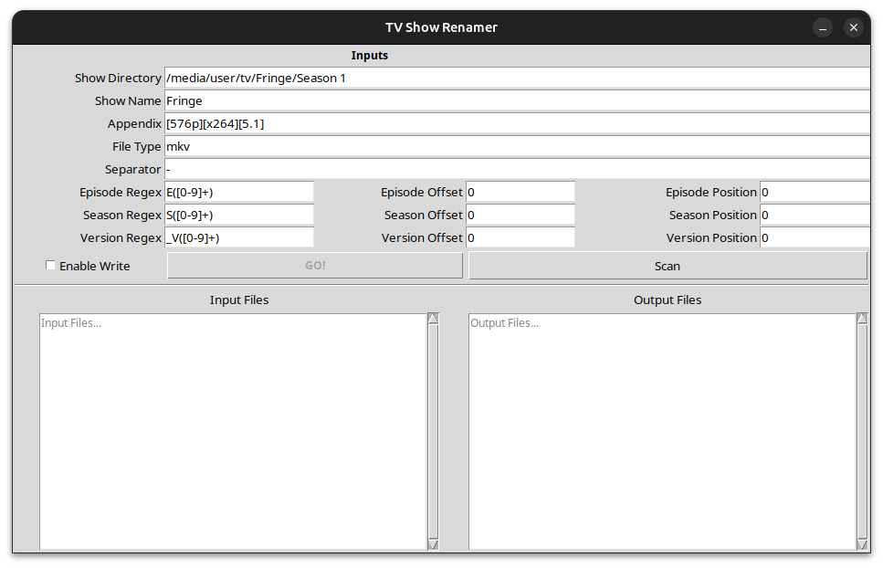
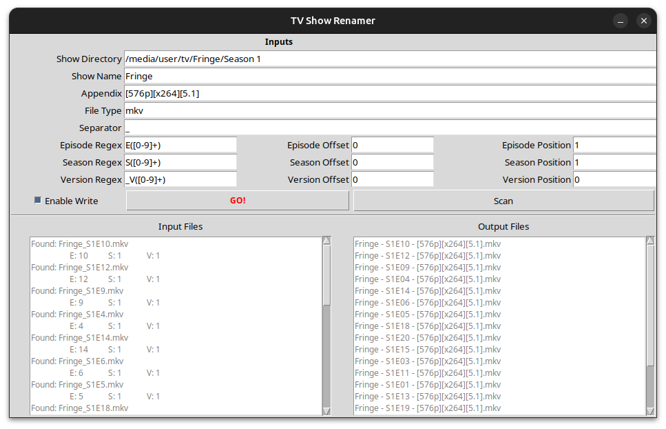

# TV Batch-Renamer

A small utility that I wrote to assist with renaming large collections of TV
show media files.

I just wanted to share this as it grew into something quite "complete" and
pretty easy to use. Feel free to use it to your likings (support not included
 😉).

## Prerequisites

- Python (>= 3.11)

> [!NOTE]
> This application is mainly prepared for usage in a UNIX-like environment.
>
> I tested functionality on Windows just briefly. Tested are only basic file
> paths (e.g. local disks, mounted network shares, etc.). To this extend it
> *seems* to work.

## Overview

This app is capable of renaming any number of files in a given directory
according to specified rules.

These files are mainly bound to be already named after some sort of
`season/episode` schema. I followed the official notes from
[Plex](https://support.plex.tv/articles/naming-and-organizing-your-movie-media-files/)
regarding this setup. Renaming will take place given only the **name of the file**
.

> [!NOTE]
> The only information that needs to be located inside the filename are season
> and episode.

## Run the App

Run the application simply via a Python call:

```bash
python3 tv_renamer
```

There is also the possibility to pass the current directory to initiate the
batch renamer in the given directory:


```bash
python3 tv_renamer $PWD
```

This will launch the app with the current work directory set as show directory
to scan (explained down below). I use this as simple setup with an `alias` to
run as a single command everywhere on my machine.

> [!NOTE]
>  
> On Windows this can be something like a simple batch file inside a local
> repo copy launching Python via `python -m tv_renamer`. This seems to also work
> with the configuration without any issues. Then simply create a link to the
> script somewhere else.

### Interface



The interface consists of simple input settings for the renamer to take action.
These cover the following functions:

#### Input Detection

Base for the detection is the **Show Directory**. This directory should contain
all media files that need to be renamed.

**File Type** refers to the file extension of your media files. This is
**case-sensitive**!

**Separator** is the separator for the input file name blocks which splits the
individual parts of the filename apart.

#### Regex Settings

Automatic detection for episode and season number is done via the given **Regex**
values.

> [!NOTE]
> Each regex needs to have exactly one capture group for the actual number!

Each number can have an arbitrary **Offset** value added to it. These can also
be negative.

The **Position** value refers to the indexing position of the value for each
number. Indexing is done on the list of filename elements split with the given
separator.

> [!NOTE]
> Index values start at 0:
>
> Index: 1, Separator: "-"
>
> "My-file-name" = "file"

#### Output Settings

**Show Name** and **Appendix** are the output settings for the renamed file. The
appendix will be put at the end of the file.

---

The **Version** entry is completely optional. This can be used to detect a
version index inside the file that will be put into the resulting filename.
This is generally in the form of: `S1E01_V2`.

This option is not needed (although the field have to carry some value). It will
be only applied if different from `1` (basically `V2, V3, ...`).

### Operation

To run the batch renaming two options are given.

> [!WARNING]
> Scan and Renaming operation are **recursive** from the given main directory!

---

**Scan** will only scan the directory given for any files to rename. The output
of the renaming operations will be displayed in the lower text fields.

**Input Files** contains all files matched by the scan with the detected values
included in the list.

**Output Files** contains all filenames as result of the renaming procedure.

---

**GO!** will initiate the renaming procedure. This needs to be enabled with the
Enable Write checkbox beforehand.

## Example



Example run with separator `_` and season and episode positions set to 1:

Input -> Output:
```
Fringe_S1E1.mkv -> Fringe - S1E01 - [576p][x264][5.1].mkv
Fringe_S1E2.mkv -> Fringe - S1E02 - [576p][x264][5.1].mkv
Fringe_S1E3.mkv -> Fringe - S1E03 - [576p][x264][5.1].mkv
Fringe_S1E4.mkv -> Fringe - S1E04 - [576p][x264][5.1].mkv
Fringe_S1E5.mkv -> Fringe - S1E05 - [576p][x264][5.1].mkv
Fringe_S1E6.mkv -> Fringe - S1E06 - [576p][x264][5.1].mkv
Fringe_S1E7.mkv -> Fringe - S1E07 - [576p][x264][5.1].mkv
Fringe_S1E8.mkv -> Fringe - S1E08 - [576p][x264][5.1].mkv
Fringe_S1E9.mkv -> Fringe - S1E09 - [576p][x264][5.1].mkv
Fringe_S1E10.mkv -> Fringe - S1E10 - [576p][x264][5.1].mkv
Fringe_S1E11.mkv -> Fringe - S1E11 - [576p][x264][5.1].mkv
Fringe_S1E12.mkv -> Fringe - S1E12 - [576p][x264][5.1].mkv
Fringe_S1E13.mkv -> Fringe - S1E13 - [576p][x264][5.1].mkv
Fringe_S1E14.mkv -> Fringe - S1E14 - [576p][x264][5.1].mkv
Fringe_S1E15.mkv -> Fringe - S1E15 - [576p][x264][5.1].mkv
Fringe_S1E16.mkv -> Fringe - S1E16 - [576p][x264][5.1].mkv
Fringe_S1E17.mkv -> Fringe - S1E17 - [576p][x264][5.1].mkv
Fringe_S1E18.mkv -> Fringe - S1E18 - [576p][x264][5.1].mkv
Fringe_S1E19.mkv -> Fringe - S1E19 - [576p][x264][5.1].mkv
Fringe_S1E20.mkv -> Fringe - S1E20 - [576p][x264][5.1].mkv
```

## Configuration

Application settings are preserved between sessions inside `config.json`. This
file needs to be formatted according to the given example `default.json`!

An optional setting `episode.largest` is included in this file (not in the GUI
atm). This value can hold any number for the largest episode number for a media
file to contain. That way the renamer will try and fill the remaining places
with zeros to the maximum number given here.

---

## Dev

### Setup

For development an extra `pyproject` target `dev` is defined. Best is to install
the app in editable mode:

```bash
pip install -e .[dev]
```

Of course the use of a virtual environment is highly encouraged 😉

### Testing

The main backend is tested using `pytest`. Best is to install the `dev`
dependencies to enable test support. Then simply run all unit-tests:

```bash
coverage run -m pytest test --cov=tv_renamer --cov-report=html --cov-report=xml
```

Coverage report is then output as HTML for web viewing or as XML for usage
inside your IDE.
